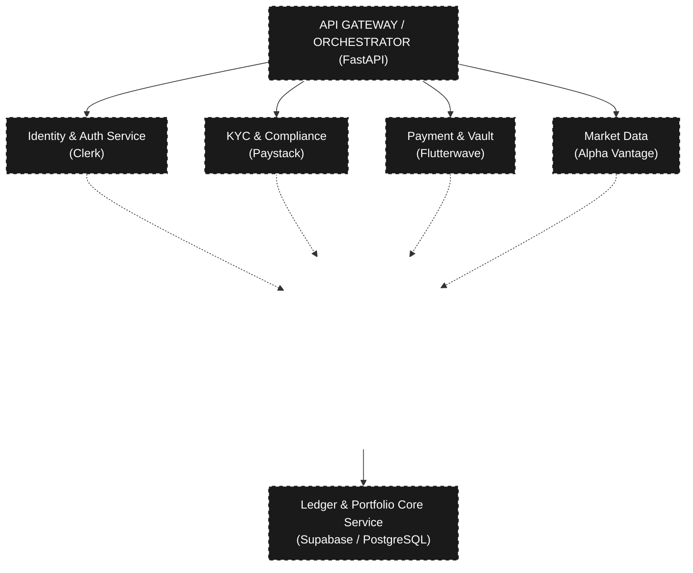

# 💰 The Wealy App

A premium, full-stack wealth management platform designed to automate identity verification, fiat deposits via virtual accounts, and global market investments for retail users in Nigeria (NGN base currency). Built with **React (Vite)** on the front end and **FastAPI (Python)** on the back end.

---

## 🏗️ System Architecture

The system acts as a consolidated orchestrator connecting various API providers into a single streamlined pipeline: Authentication -> KYC Registration -> Wallet Generation -> Real-time Ledger Management -> Asset Purchases.



---

## 📁 Project Structure

```
Wealy-2026/
├── wealy-backend/     → Python API server (FastAPI + Supabase + Flutterwave)
├── wealy-frontend/    → React UI (Vite + Vanilla CSS)
├── Wealy UI/          → Original Figma design exports (PNG)
├── TRD.md             → Technical Requirements Document
└── master_roadmap.md  → Project planning notes
```

---

## 🔑 How the Product Works (End-to-End User Flow)

Wealy abstracts the complexity of financial compliance and orchestration through a strict sequential journey:

1. **Gate 1 (Auth):** User attempts logging in via the `/auth/login` endpoint using Clerk's backend SDK. 
2. **Gate 2 (Identity & KYC):** The application queries profiles in Supabase. If missing, it prompts the user to enter their BVN (Bank Verification Number) to hit Paystack's endpoint. Unverified users (Tier 1) have strict limits, while verified users (Tier 2) unlock full features.
3. **Gate 3 (Vault Generation):** Successful KYC causes Wealy to request a Flutterwave virtual account, logging the `account_number` into the verified profile. This provides a permanent NGN virtual account for the user.
4. **Gate 4 (Funding & Ledger):** User sends money natively to their dedicated virtual account. The Flutterwave backend detects it and sends a webhook to Wealy. A continuous polling ledger calculates the user's balance dynamically by summing all successful `DEPOSIT` and `WITHDRAWAL` transactions, preventing double-debits via an idempotency shield.
5. **Gate 5 (Investing):** User clicks "Buy APPL". The backend pulls the live price from Alpha Vantage, checks if the fiat balance covers the USD/NGN converted price, and executes the trade. It writes a `DEBIT` for fiat and an `INVESTMENT` record in the portfolio table.

---

## ⚙️ Prerequisites

Make sure you have the following installed before you begin:

| Tool | Version | Download |
|------|---------|----------|
| **Node.js** | LTS (v20+) | [nodejs.org](https://nodejs.org) |
| **Python** | 3.11+ | [python.org](https://www.python.org) |
| **pip** | (comes with Python) | — |

---

## 🖥️ Running the Backend (`wealy-backend`)

The backend is a **FastAPI** server that connects to Clerk, Supabase, Paystack, Flutterwave, and Alpha Vantage.

### Step 1 — Install Python dependencies

Open a terminal and run:

```bash
cd wealy-backend
pip install -r requirements.txt
pip install fastapi uvicorn
```

### Step 2 — Check your environment variables

Open `wealy-backend/.env` and confirm all keys are filled in:

```env
CLERK_SECRET_KEY=sk_test_...
NEXT_PUBLIC_CLERK_PUBLISHABLE_KEY=pk_test_...
PAYSTACK_SECRET_KEY=sk_test_...
WEALY_SUPABASE_URL=https://...supabase.co
WEALY_SUPABASE_KEY=eyJ...
FLUTTERWAVE_SECRET_KEY=FLWSECK_TEST-...
ALPHA_VANTAGE_API_KEY=...
```

### Step 3 — Start the API server

```bash
cd wealy-backend
uvicorn api:app --reload
```

✅ The backend will be running at: **`http://localhost:8000`**

You can explore all API endpoints at: **`http://localhost:8000/docs`** (auto-generated by FastAPI)

---

## 🎨 Running the Frontend (`wealy-frontend`)

The frontend is a **React + Vite** application.

### Step 1 — Install Node dependencies

> ⚠️ Only needs to be done once.

```bash
cd wealy-frontend
npm install
```

### Step 2 — Start the development server

```bash
cd wealy-frontend
npm run dev
```

✅ The frontend will be running at: **`http://localhost:5173`**

---

## 🚀 Running the Full Stack

You need **two terminals open at the same time**:

| Terminal | Command | URL |
|----------|---------|-----|
| **Terminal 1 (Backend)** | `cd wealy-backend && uvicorn api:app --reload` | `http://localhost:8000` |
| **Terminal 2 (Frontend)** | `cd wealy-frontend && npm run dev` | `http://localhost:5173` |

Then open your browser and go to **`http://localhost:5173`**.

---

## 🛠️ API Endpoints (Quick Reference)

| Method | Endpoint | Description |
|--------|----------|-------------|
| `POST` | `/api/auth/login` | Authenticate with Clerk |
| `GET` | `/api/profile/{clerk_id}` | Fetch profile + wallet balance |
| `POST` | `/api/kyc` | BVN verification via Paystack |
| `POST` | `/api/wallet/deposit` | Initiate Flutterwave payment link |
| `POST` | `/api/wallet/withdraw` | Withdraw funds to bank |
| `GET` | `/api/market/assets` | List tradeable assets |
| `GET` | `/api/market/price/{symbol}` | Live price from Alpha Vantage |
| `POST` | `/api/market/buy` | Invest in an asset |
| `GET` | `/api/portfolio/{clerk_id}` | Full portfolio + P&L summary |

---

## 🐛 Troubleshooting

**`npx` not recognised** → Node.js is not installed. Download it from [nodejs.org](https://nodejs.org).

**`uvicorn` not recognised** → Run `pip install uvicorn` first.

**CORS errors in browser** → Make sure the backend is running on port `8000` and frontend on port `5173`.

**Login fails with "No account found"** → The email must exist in your Clerk dashboard at [dashboard.clerk.com](https://dashboard.clerk.com).

**Deposit button does nothing** → KYC must be completed first (BVN must be verified). Navigate to `/verification`.
